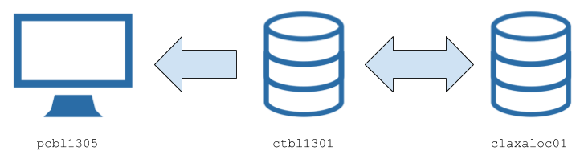

+++++++++++++++++++++++++++++
Configuration and Deployment
+++++++++++++++++++++++++++++
---------------------------
Current production version
---------------------------
The current version of `MXCuBE` for XALOC runs at `ctbl1301.cells.es` machine. However,
the users use a launcher script from `pcbl1305` machine which runs a production instance
of the application in the `ctbl1301 server`::

    /homelocal/sicilia/bin/mxcube (in pcbl1305.cells.es)

The current `MXCuBE` version is defined by a checkout of 3 repositories: the `mxcube`
repository, the `HardwareRepository` and the `bl13_mxcube_config` repository which contains
the specific XALOC configuration files i.e. the Hardware Objects configuration, the GUI layout,
the launchers, etc.

The `sicilia` home folder contains different copies of the repositories within subfolders,
with the aim to define different working copies for different purposes.

The `git` folder
-----------------
Contains the checkout of the MXCuBE repositories (and also the ones for those components
that cannot be installed via `apt-get`, `pip`, etc... for instance, the centring library `lucid2`)::

    /homelocal/sicilia/git/mxcube
    /homelocal/sicilia/git/bl13_mxcube_config

The aim of these checkouts is to provide a tracked copy of the MXCuBE code for development
purposes. The repository points to the the ALBA-Synchrotron fork in GitHub and the
MXCuBE application can be easily launched by using executing::

    mxcube-git

which is an `alias` defined in `.bash_local.rc` file.

The `production` folder
-----------------------
This folder contains a `deployed` copy of the MXCuBE code from the `git` repository folder::

    /homelocal/sicilia/production/mxcube
    /homelocal/sicilia/production/bl13_mxcube_config

The deployment of a production version is done by executing the automatic deployment script::

    deploy_mxcube

from within the `mxcube` repository in the git folder. This is, in fact, an alias also
defined in the same `.bash_local.rc` file.

The deployment procedure
-------------------------
This deployment procedure will `archive` the current status (i.e. latest committed
changes) of the MXCuBE repositories and create `gzipped` files indexed by the
corresponding hash. Then the script automatically uncompress the code to the
`production` folder in such a way the MXCUBE application deployed can be launched by
using the alias::

    mxcube

This defines the `handmade` deployment schema for MXCuBE at XALOC:

    #. Update the `git` repository to the desired deployment version.
    #. Run the deployment script to install the new version and backup the old one.

The`.bash_local.rc` file
========================

This is an example of the local `bash_local.rc` file containing all required definitions and export
to run `MXCuBE` in different modes:

.. code-block:: bash

    #!/usr/bin/env bash

    # Utils for bash shell
    source /beamlines/bl13/controls/devel/scripts/bash.git.rc
    source /beamlines/bl13/controls/devel/scripts/bash.path.rc

    # MXCuBE executables
    alias mxcube='/homelocal/sicilia/production/bl13_mxcube_config/bin/mxcube --pyqt4'
    alias mxcube-git='/homelocal/sicilia/git/bl13_mxcube_config/bin/mxcube-git --pyqt4'
    alias mxcube-devel='/homelocal/sicilia/devel/pycharm/MXCuBE-devel/bl13_config/bin/mxcube-devel --pyqt4'
    alias mxcube-mockup='/homelocal/sicilia/devel/pycharm/MXCuBE-mockup/bl13_config/bin/example_mxcube_qt4 --pyqt4'

    # Deployment from git tools
    alias deploy_mxcube='/homelocal/sicilia/devel/pycharm/MXCuBE-devel/bl13_config/utils/deploy_mxcube.sh'
    alias deploy_from_git='/homelocal/sicilia/devel/pycharm/MXCuBE-devel/bl13_config/utils/deploy_from_git.sh'

    # Cluster access machine
    export CLA=claxaloc01
