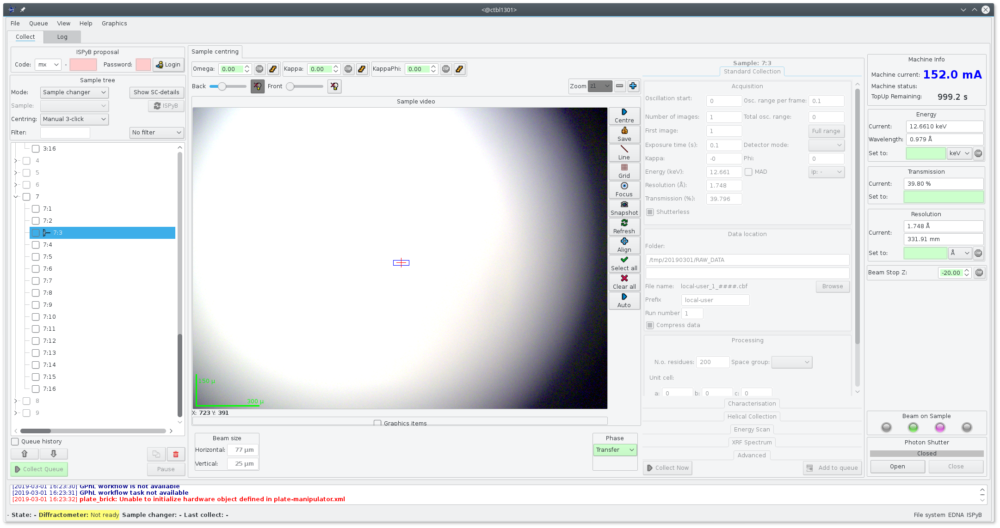
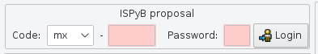
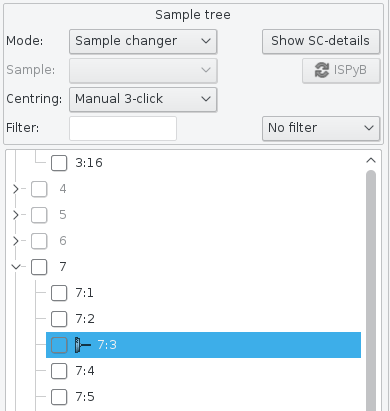
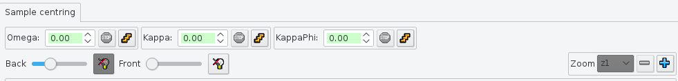
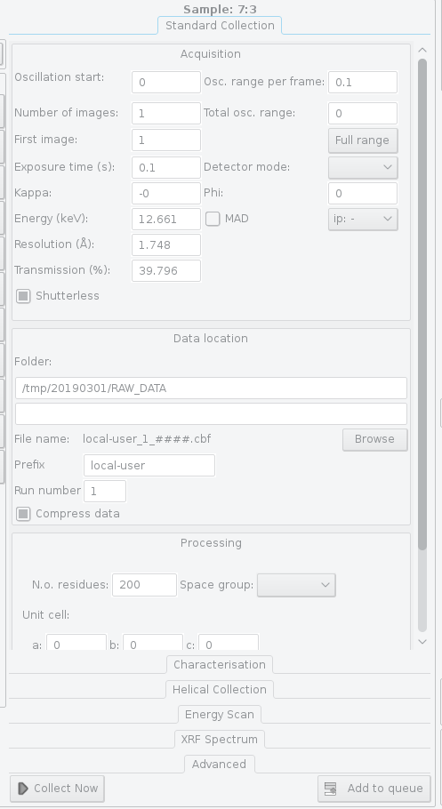
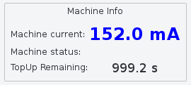
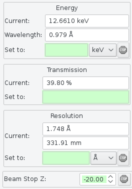
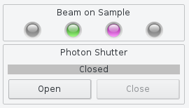

+++++++++++
GUI layout
+++++++++++

----------------
User login
----------------

To use MXCuBE users must log in the system. 

User credentials correspond to those in ALBA LDAP system.
If LDAP credentials are validated **mxcube** will then check if
the user name correspond to a registered proposal in the database with
scheduled session corresponding to the present date.  If that is not
the case a session will be created ad-hoc.

Once logged in, **mxcube** will save all the data generated during
data collection in the corresponding user directory following a well-defined
scheme (see the :ref:`Data Storage page <folder_structure>` for details.  
At the same time **metadata** corresponding to data collections will
be written in the **ispyb** database (check below for details).

----------------
Sample mounting
----------------

On startup **mxcube** will request the **PyCats** sample changer for samples present in the sample changer dewar. With this information **mxcube** will
present available samples both in the *Sample Tree* in the left panel of the graphical interface
and at the same time in the pane that is presented when clicking on the *SC Details* button.

Doing a mouse *righ-click* over the sample list in the *Sample Tree* will then let the user mount a
sample, or unmount the sample that is currently mounted. 

For more actions on the use of the sample changer user should use the *SC Details* pane. 
**mxcube** will show at all moments the sample that is currently mounted with a special icon. Samples
that were previously mounted (since **mxcube** was started) will be shown in blue in the *SC Details* pane.

The list of sample present in the dewar will be updated automatically and the corresponding
graphics will be automatically updated.

----------------
Sample centring
----------------

-----------------
Data collections
-----------------

Standard Collection, Characterization, Helical collection, Mesh / Grid, EnergyScan,
Advanced Methods.

-------------
Machine info
-------------

-------------
Energy setup
-------------

energy
---------
Beamline energy can be set to the value selected by the user from the right pane in
the **mxcube** graphical interface.

Energy value can be provided either as energy (values in kEV) or in terms of wavelength
(values in angstroms).

The value can be also entered as a parameter for data collection procedures. In that case
**mxcube** will set the monochromator to the parameter value before starting the data collection.

transmission
-------------
In the experimental hutch there exist a set of filters to attenuate the incoming beam intensity
as required to reduce radiation damage on the sample.

**mxcube** allows to enter a *transmission* value as a percentage (0-100) of the maximum intensity
value. On request filters will be set to obtain the closest transmission value to the one required
by the user. Beware that due to the discrete nature of filter combinations the final tranmissin value
will not be exactly the one requested.  **mxcube** will show the real transmission value set.

As for the energy it is possible also to enter a transmission value as a parameter for data collection.
The transmission value will be set prior to the beginning of the data collection.

resolution
-------------

User can also select in the same way a *resolution* value.  The value could be entered either as *resolution*
or as detector distance (from the sample).  **mxcube** will move the detector to obtain the resolution required
by the user.

As for energy and transmission, it is possible also to enter a resolution value as a data collection parameter.

-------------
Shutters
-------------

