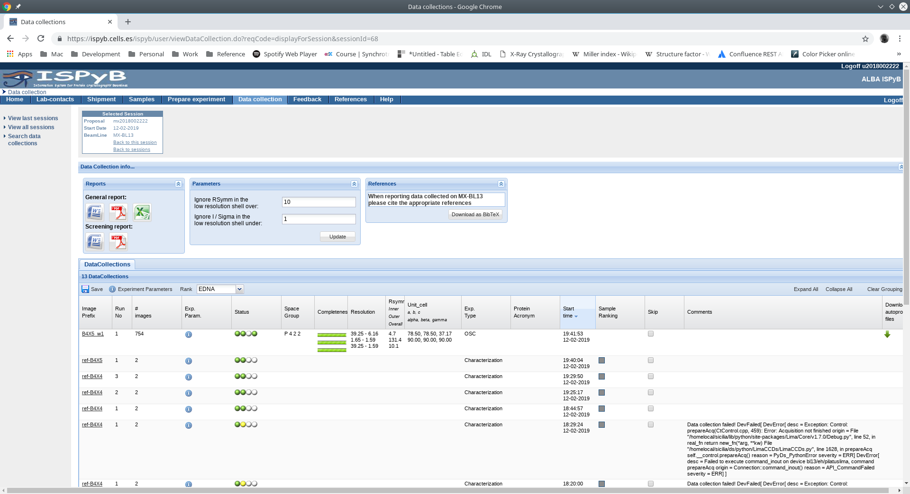

++++++++++++++++
ISPyB
++++++++++++++++

The `ISPyB` web service is used to exchange information between the `User Office` and the MXCuBE
application about information about the samples. Moreover, the results obtained from the
data processing via `EDNA` plugins are collected and uploaded to the ISPyB database.

These `ISPyB` service can be accessed at::

    https://ispyb.cells.es

using the user and proposal information.

